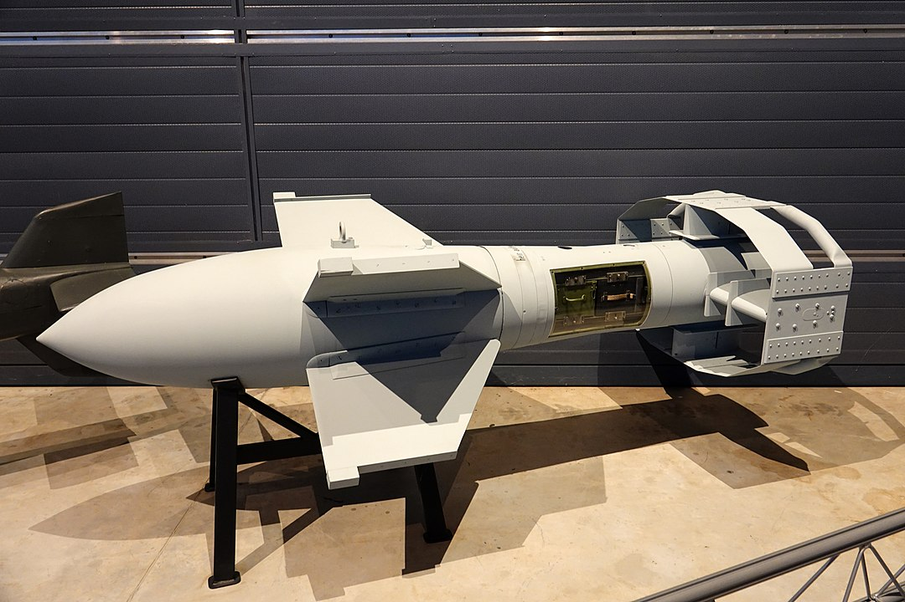

<!-- PROJECT LOGO -->
 

  

<h3 align="center">UK WW2 Warship Losses in the Mediterranean</h3>

  

    This is a simple web scraping exercise that results in a list of UK warships losses during WW2 during the Battle of the Mediterranean.
     
     
    <a href="https://github.com/ziggle/Med_Losses/issues">Report Bug</a>
    ·
    <a href="https://github.com/ziggle/Med_Losses/issues">Request Feature</a>
  

<!-- TABLE OF CONTENTS -->

  
Background

  <ol>
    <li>
      <a href="#about-the-project">About The Project</a>
      <ul>
        <li>Project is intended to be a tutorial example of how to scrape a web page using Rvest and Rmarkdown</li>
        <li><a href="#built-with">This project was developed in Rstudio using Rmarkdown.</a></li>
        <li><a href="https://www.naval-history.net/WW2BritishLossesbyArea08.htm">Web page being scraped</a></li>
      </ul>
    </li>
    <li>Objectives
      <ul>
        <li>I have become a big fan of XPATH for web scraping, which is used in this example.</li>
        <li>It provides a good example of the kind of problems faced while web scraping OCRed web pages.</li>
        <li>I am interested in all things WW2 and the UKs Mediterranean campaign is almost unknown to me.</li>
      </ui>
    </li>
  </ol>

<!-- LICENSE -->
## License

Distributed under the MIT License. See `LICENSE.txt` for more information.

(<a href="#top">back to top</a>)

<!-- CONTACT -->
## Contact

Mark Biegert - [@mrb1618](https://twitter.com/mrb1618) - mbiegert314@gmail.com

Project Link: [https://github.com/ziggle/Med_Losses](https://github.com/ziggle/Med_Losses)

(<a href="#top">back to top</a>)

<!-- ACKNOWLEDGMENTS -->
## Acknowledgments

* [Miltary History Not Visualized](https://www.youtube.com/c/MilitaryHistoryVlogs)
Great interview with Drachinifel on the Battle of the Mediterranean.

* [Drachinifel](https://www.youtube.com/c/Drachinifel)
Drach made the comment about the 135 warships lost that piqued my curiousity.

(<a href="#top">back to top</a>)

